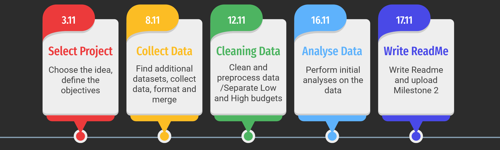

# :movie_camera: Showdown in Hollywood

## Abstract
The film industry is a growing industry of $42.2 billion in 2019 in theatrical box office alone. Including home entertainment, it reached [$139 billion in 2018](https://en.wikipedia.org/wiki/Film_industry). However, a big budget doesn't always mean an important `return on investment` (ROI). In 2002, the film `The Adventures of Pluto Nash` cost $100 million to produce but generated only [$7 million](https://en.wikipedia.org/wiki/The_Adventures_of_Pluto_Nash). This example shows that a high budget is not always synonymous with a profitable return. Is this also true for low-budget films? That's what two producer friends with very different wallets ask themselves over a drink. "I bet I can multiply my investment a lot more than you can with my big-budget film!". "We'll see about that!" replies the other with modesty. Let's follow these two friends on their existing adventure and see what we can do to help! This story will take us to the core of the movie industry by exploring interesting parameters of the [CMU Movie Summary Corpus](http://www.cs.cmu.edu/~ark/personas/) and finding the best choices for both `high` and `low` budget producers.

## :thought_balloon: Research Questions
The main metric that we will use in this project to measure the profitability of a movie will be the `multiplier` between the initial cost and the box office revenue. This technique allows us to cancel the effet of inflation and thus compare older movies with the new ones using the same metric. During our analysis, we will try to answer the following questions:
1. Which characteristics/features of a movie have a significant effect on its box office revenue with respect to its cost (`multiplier`)?
2. Is there a common `strategy` among low and high budget movies to maximize their multipliers or is it different ? If so, in which aspect(s) of the movie ?
3. Is it generally sufficient to `increase the budget` of a given movie to increase its multiplier ?

## :file_folder: Additional Datasets
* [Wikidata](https://www.wikidata.org/wiki/Wikidata:Main_Page?uselang=fr): using the `WikiPageID` feature present in the [CMU Movie Summary Corpus](http://www.cs.cmu.edu/~ark/personas/), we are able to extand the latter with essential missing features for our analysis. It is a convenient and reliable source to get structured movie data such as `cost` and `currencyCode`, two crucial parameters to compute the `multiplier` for a given movie. This data can be found in our repository under the name film_wiki_data_formatted.csv.
* [Conversion rates](ADD_SOURCE_HERE): as explained earlier, the extracted costs are not necessarily in `USD`. This makes sense because many movies are indeed not produced in the United States. It follows that conversion rates data was necessary to conduct a propoer analysis over the costs of movies that are produced in various currencies. The conversion rates of INSERT_TIME_HERE are stored in usd_conversion_rates.json.
* [TMDB](https://www.themoviedb.org/): even by using Wikidata, we are still missing information about the cost of many movies. We are considering using the TMDB database to extand our `cost` feature to more movies of our current dataset. Their convinient API would be a good option to achieve this task.

## 🛠️ Methods

### Preprocessing

The initial stage involves data preprocessing, cleaning, and merging disparate datasets. For instance, we utilize the [Wikidata](https://www.wikidata.org/wiki/Wikidata:Main_Page?uselang=fr) dataset and [TMDB](https://www.themoviedb.org/) to enrich our dataset with vital missing features. A conversion rate to ***USD*** is applied to all different currencies to ensure uniformity in our data. The resulting dataset contains all the films for which we have information about the `cost` of the film and the `Box_office_revenue`, these two attributes being necessary for our work.

### Separation of Low and High Budget Films

To distinguish between `low` and `high`-budget films, we categorize films into five-year groups based on their release dates. The top 30% of films with the highest budgets and the bottom 30% with the lowest budgets are then identified within each time frame. This process mitigates the impact of ***inflation*** on budget categorization. Subsequently, all high-budget films from different periods will be regrouped into a single high-budget category, and the same will be done for low-budget films. The focus will then shift to analyzing the `multiplier` for each film. The use of the multiplier helps neutralize inflation effects within each category, ensuring a fair comparison across different years.

### Regression (To be conducted Milestone 3)

Regression analysis will be employed to identify optimal strategies for both budget categories. We will specifically select features that producers can influence, such as the film's runtime, number of actors, and genre. Using these impactful features, we will train the model to **predict** the `multiplier` between the initial cost and box office revenue. This will allow us to determine the features necessary to achieve the ***optimum multiplier*** for each budget category. The analysis will be conducted separately for low and high-budget films, highlighting differences in feature selection strategies and maximum expected values of the multiplier.

### T-Tests (To be conducted Milestone 3)

To ascertain if there is a significant difference in ***Return on Investment*** (ROI) between low and high-budget films, t-tests will be employed. This statistical test will aid in evaluating whether the observed differences in ROI are statistically significant or if they could have occurred by chance.

## 📆 Proposed timeline

## 🤝 Organization within the team
<table class="tg" style="table-layout: fixed; width: 342px">
<colgroup>
<col style="width: 16px">
<col style="width: 180px">
</colgroup>
<thead>
  <tr>
    <th class="tg-0lax">Teammate</th>
    <th class="tg-0lax">Contributions</th>
  </tr>
</thead>
<tbody>
  <tr>
    <td class="tg-0lax">Diogo</td>
    <td>
        <ul>
            <li>Data collection from other datasets</li>
            <li>Formatting the data ang merging with our dataset</li>
        </ul>
    </td>
  </tr>
  <tr>
    <td class="tg-0lax">Charlotte</td>
    <td>
        <ul>
            <li>Cleaning and merging the datasets</li>
            <li>Clustering of the high and low budgets</li>
        </ul>
    </td>
  </tr>
  <tr>
    <td class="tg-0lax">Tomas</td>
    <td>
        <ul>
            <li>Cleaning and merging the datasets</li>
            <li>Clustering of the high and low budgets</li>
        </ul>
    </td>
  </tr>
  <tr>
    <td class="tg-0lax">Léo</td>
    <td>
        <ul>
            <li>Writing the Readme</li>
            <li>Performing initial analysis on the data</li>
        </ul>
    </td>
  </tr>
  <tr>
    <td class="tg-0lax">Joanna</td>
    <td>
        <ul>
            <li>Writing the Readme</li>
            <li>Performing initial analysis on the data</li>
        </ul>
    </td>
  </tr>
</tbody>
</table>
